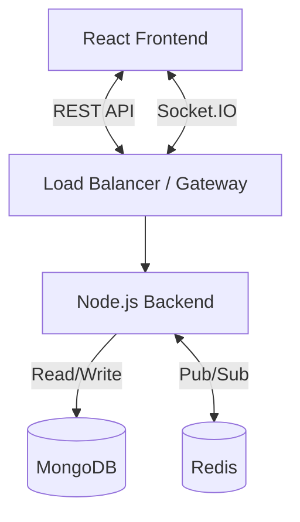

# System Design Document
## Project: Internal Real-Time Project Management System

### 1. High-Level Architecture
The system follows a decoupled **MERN (MongoDB, Express, React, Node.js)** architecture, ensuring separation of concerns and scalability.

- **Frontend (Client)**: React Single Page Application (SPA) deployed on Vercel. Consumes REST APIs and connects via WebSocket (Socket.IO).
- **Backend (Server)**: Node.js/Express REST API deployed on Render. Handles business logic, database interactions, and WebSocket events.
- **Database**: MongoDB (NoSQL) for flexible schema design.
- **Real-Time Layer**: Socket.IO for bidirectional communication.
- **Caching/PubSub**: Redis used as a Socket.IO adapter to support horizontal scaling (allowing multiple backend instances to broadcast events correctly).



### 2. API Design (REST)
All API endpoints will be prefixed with `/api`.

| Method | Endpoint | Purpose | Access |
| :--- | :--- | :--- | :--- |
| **Auth** | | | |
| POST | `/auth/login` | Authenticate user & return JWT | Public |
| GET | `/auth/me` | Get current user details | Protected |
| **Projects** | | | |
| GET | `/projects` | List all projects | Protected |
| POST | `/projects` | Create a new project | Protected |
| GET | `/projects/:id` | Get project details | Protected |
| **Tasks** | | | |
| GET | `/projects/:id/tasks` | Get tasks for a project | Protected |
| POST | `/tasks` | Create a new task | Protected |
| PUT | `/tasks/:id` | Update task (status, assignee, etc.) | Protected |
| DELETE | `/tasks/:id` | Delete a task | Protected |

### 3. Database Schema (MongoDB)
*Note: Using Mongoose for modeling.*

**User Schema**
```json
{
  "_id": "ObjectId",
  "username": "String (Unique)",
  "password": "String (Hashed)",
  "role": "String ('admin', 'member')",
  "createdAt": "Date"
}
```

**Project Schema**
```json
{
  "_id": "ObjectId",
  "name": "String",
  "description": "String",
  "owner": "ObjectId (Ref: User)",
  "members": ["ObjectId (Ref: User)"],
  "createdAt": "Date"
}
```

**Task Schema**
```json
{
  "_id": "ObjectId",
  "title": "String",
  "description": "String",
  "status": "String ('TODO', 'IN_PROGRESS', 'DONE')",
  "project": "ObjectId (Ref: Project)",
  "assignee": "ObjectId (Ref: User)",
  "priority": "String ('LOW', 'MEDIUM', 'HIGH')",
  "createdAt": "Date"
}
```

### 4. Real-Time Strategy (Socket.IO)
We choose **Socket.IO** over polling or Webhooks because:
1.  **Low Latency**: Push-based updates are instant compared to polling intervals.
2.  **Efficiency**: Reduces server load by avoiding redundant HTTP requests.
3.  **Room Support**: Built-in support for "rooms" allows us to scope events to specific projects (e.g., only users viewing Project A get updates for Project A).

**Socket Events**
- `join_project`: Client joins a room named `project:{projectId}`.
- `task_created`: Server emits when a task is created. Payload: `{ task }`.
- `task_updated`: Server emits when status/details change. Payload: `{ taskId, updates }`.
- `task_deleted`: Server emits when a task is removed. Payload: `{ taskId }`.

**Redis for Scalability**
- We will use the `@socket.io/redis-adapter`.
- Redis acts as a message broker (Pub/Sub).
- If we scale the backend to multiple instances (dynos) on Render, User A connected to Instance 1 can update a task, and User B connected to Instance 2 will still receive the update because the event is published to Redis and subscribed to by all instances.

### 5. Authentication Flow (JWT)
1.  User posts credentials to `/auth/login`.
2.  Server verifies hash, generates a **JWT (JSON Web Token)** signed with a secret.
3.  Server returns JWT.
4.  Client stores JWT (HTTPOnly Cookie preferred, or LocalStorage for this MVP).
5.  **REST Requests**: Client sends `Authorization: Bearer <token>` header.
6.  **Socket Connection**: Client sends token during handshake `auth: { token }`. Socket middleware verifies JWT before allowing connection.

### 6. Design Trade-offs
- **MongoDB vs SQL**: Chosen MongoDB for flexible schema as task attributes might evolve (e.g., custom fields).
- **Socket.IO vs Native WS**: Socket.IO adds overhead but handles reconnection, fallbacks, and room logic automatically, which speeds up development.
- **REST vs GraphQL**: REST is sufficient for the defined scope and easier to secure/rate-limit for standard resource operations.
